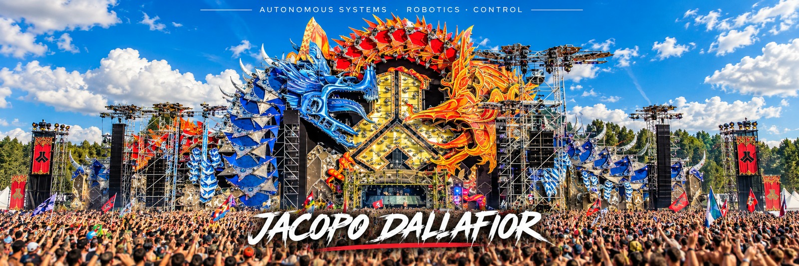

Hi, I'm Jacopo Dallafior 👋

🤖 Autonomous Systems · Robotics · Control · Mechatronics

**Mechatronics Engineer** interested in **Autonomous Systems, Robotics, Control Theory, Computer Vision, Machine Learning, and intelligent machines**.

  
  
  

---

## ⚙️ SYSTEM MODULES

  

<table align="center">
<tr>
<td valign="top" width="50%">

### 🧠 Control & Robotics

`Model Predictive Control`  
`System Modeling`  
`Simulation`  
`UAV Control`  
`SLAM`  
`VIO`  
`PX4`

</td>
<td valign="top" width="50%">

### 🛠 Engineering

`MATLAB / Simulink`  
`KiCad`  
`Inventor`  
`AutoCAD`  
`Simcenter 3D`  
`SimScale`

</td>
</tr>
</table>

---

## 📊 TELEMETRY

  
  

  

---

## 🎓 EDUCATION

<table>
<tr>
<td>🎓</td>
<td><b>KTH Royal Institute of Technology</b> ICT Innovation — Autonomous Systems</td>
</tr>
<tr>
<td>🎓</td>
<td><b>University of Trento</b> Mechatronics Engineering</td>
</tr>
<tr>
<td>🎓</td>
<td><b>University of Trento</b> BSc in Industrial / Mechatronics Engineering</td>
</tr>
</table>

---

### `PERCEIVE → DECIDE → ACT`

*Building systems that perceive, decide and act.*

